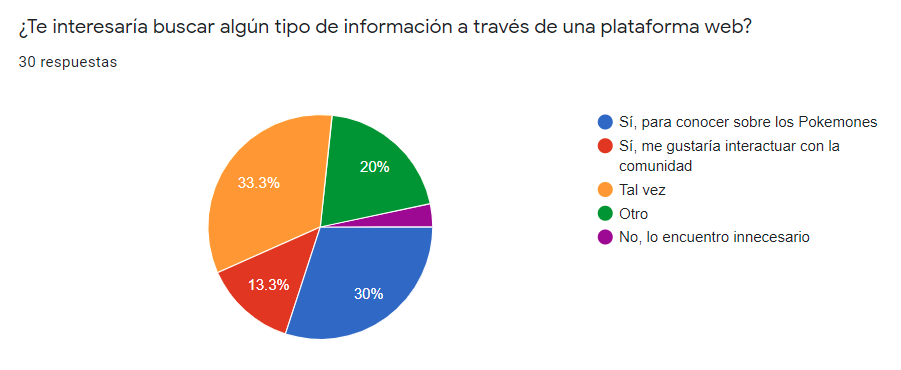
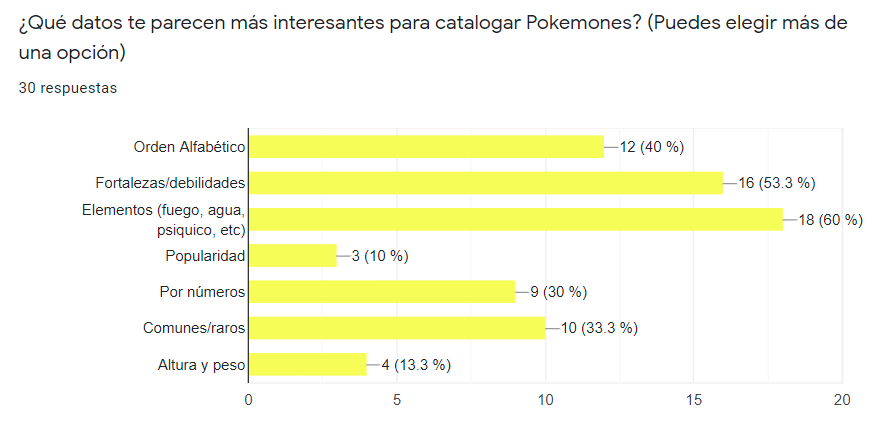
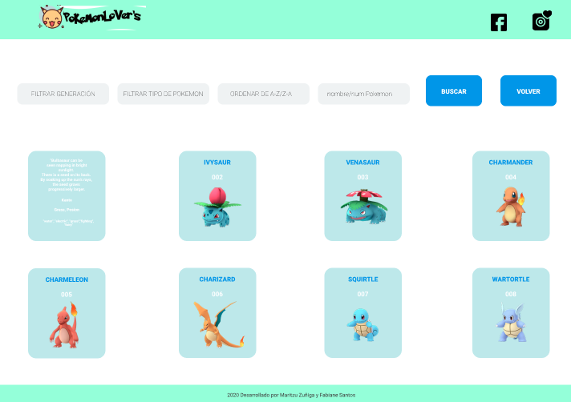

 

## **[link para PokemonLover's](https://fabianesantos.github.io/SCL014-data-lovers/src/index.html)** 

## **Índice**

* [1. Resumen del proyecto](#1-resumen-del-proyecto)
* [2. Resumen del producto](#2-pokemon-resumen-del-producto)
* [3. Planificación](#3-planificacion)
* [4. Proceso UX](#4-proceso-de-ux)
* [4. Feedback](#5-feedback)
* [6. Conclusión](#6-conclusion)
* [7. Checklist](#7-checklist)

### **1. Resumen del proyecto**

En el Proyecto Data Lovers, se pide construir una página web para visualizar un set de datos que se adecúe a las necesidades de un potencial usuario.

### **2. Resumen del producto**

**PokemonLover's** es una página web donde podrás encontrar todos los pokemones de la generación Kanto y Johto. La página cuenta también con enlaces externos, donde podrás conocer un poco más de la comunidad.

### **3. Planificación**

Empezamos a planificar todo lo que seria necesario para el desarrollo de la página web utilizando el Trello, donde nos permitió una mejor visualización de todas las etapas necesarias, y dividimos las tareas por sprint.

### **4. Proceso UX**

 Basado en ideas de las dos colaboradoras, creamos nuestro primer sketch, hecho en papel y lapis.

 ##### Definición de usuario

 Desarrollar una página web para jugadores y personas interesadas en conocer más del universo Pokemon. 

##### Encuesta On line

Fue realizada una encuesta on line con 33 usuarios, donde los usuarios contestaron algunas preguntas sobre Pokemon, y las seguientes imagenes muestran el resultado:
 
 [Link encuesta-Pokemon](https://forms.gle/xKj7JESx2EK3oUap8)

##### Historias de Usuarios

Historia de Usuario 1: Yo como usuario quiero conocer más acerca de la historia de Pokemón ya que nunca he jugado.

Historia de Usuario 2: Yo como jugador principiante quiero poder ver todos los pokemones que existen para ver si me falta conocer alguno.

Historia de Usuario 3: Yo como jugador principiante quiero poder buscar a los pokemones de acuerdo a sus fortalezas y debilidades , tipo o generación para saber cual elegir a la hora de jugar.

##### Prototipos

Fue hecho un prototipo de media fidelidad, con la App **Invision**

Prototipo de alta fidelidad hecho con **Figma** 

 

[link prototipo](https://www.figma.com/file/FNMmn7QMav1PzxJhjvWgf6/Pokemon?node-id=64%3A0)

##### Teste de Usuario

El prototipo de alta fidelidad fue testado por 5 personas, donde constatamos que:

- la segunda pantalla deberia tener colores más parecidos con la pantalla inicial,

- Mejorar las cartadex(colores, letras)

### **6. Feedbacks**  

##### Feedback de compañeros:

Con el sketcher en manos, nos reunimos con otros compañeros y recibimos un primer **feedback**, donde constatamos que debíamos enfocarnos en crear algo sencillo y funcional.

##### Feedback de coaches:

En nuestro segundo feedback, hecho con los coaches, percibimos la necesidad de cambiar algunos puntos de nuestra página web, mejorando así los colores, logotipo, etc.

### **7. Pagina web Finalizada**

### Testing

- Test unitarios

## Autor@s:

  [Fabiane Santos](https://github.com/FabianeSantos?tab=repositories)
  
  
  [Maritzu Zuñiga](https://github.com/maritz-u?tab=repositories)